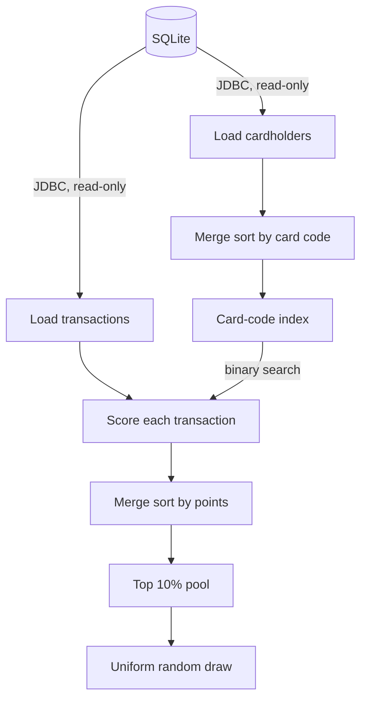

# Punchcard

A Java loyalty engine for scoring transactions, ranking cardholders, and drawing reward winners.

**Punchcard** computes loyalty points for a payment provider's customer club and draws a lottery winner from its top-scoring members. It reads cardholders and payment transactions from SQLite over JDBC, matches each transaction to its cardholder through a merge-sorted index with binary-search lookup, applies per-category scoring rules with caps, ranks cardholders by total points, and draws a winner uniformly from the top 10%.

On a synthetic dataset of 500,000 cardholders and 5.7 million transactions, a full run takes about 6.2 seconds on a single vCPU, of which 2.1 seconds is computation and the rest is reading from SQLite.

---

## Key Results

Median of three runs on 500,000 cardholders and 5,700,000 transactions (see [Benchmark](#benchmark) for the setup):

| Phase | Time | Throughput |
|---|---:|---:|
| Load from SQLite | 3.95 s | ~1.6M rows/s |
| Index cardholders (merge sort) | 0.60 s | |
| Score transactions (binary search) | 1.16 s | ~4.9M transactions/s |
| Rank cardholders (merge sort) | 0.49 s | |
| **Total** | **6.24 s** | |

Scoring results were validated against an independent pure-SQL reference implementation: both produce the same 5,586,929 scored transactions and the same top-10 leaderboard to the cent.

---

## Pipeline



1. **Load.** Cardholders and transactions are read in two sequential scans over a read-only JDBC connection.
2. **Index.** Cardholders are sorted by card code with a stable merge sort, and their codes are copied into a contiguous `int[]`.
3. **Score.** Each transaction is matched to its cardholder by binary search over that array, and its points are added to the matching category, clamped at the category cap.
4. **Rank.** Cardholders are merge-sorted by total points, descending, with card code as a deterministic tie-breaker.
5. **Draw.** A winner is drawn uniformly from the top 10% of cardholders by rank, excluding anyone with zero points.

---

## Algorithms and Complexity

For n cardholders and m transactions:

| Step | Algorithm | Time | Extra space |
|---|---|---|---|
| Index | Merge sort by card code | O(n log n) | O(n) |
| Score | Binary search per transaction | O(m log n) | O(1) |
| Rank | Merge sort by total points | O(n log n) | O(n) |
| Draw | Uniform index into the pool | O(1) | O(1) |

**Merge sort** (`algo/MergeSort`) is a stable, top-down implementation that allocates one auxiliary array for the entire sort and alternates the roles of the two arrays at each recursion level, so merges never copy data back. Subarrays of 32 elements or fewer are sorted with insertion sort, and a merge is skipped entirely when its two halves are already in order. Stability matters here: it guarantees that when card codes are duplicated, the first holder in table order is the one kept.

**Binary search** (`algo/BinarySearch`) runs over a primitive `int[]` of card codes rather than over `Holder` objects. With 500,000 cardholders, each lookup takes at most 19 comparisons and reads only 2 MB of contiguous memory instead of dereferencing object pointers scattered across the heap.

---

## Scoring Rules

Points are computed per transaction and accumulated per category. Categories with a cap are clamped on every update, so their totals can never exceed the cap.

| Category | `FinTransType` | Points per transaction | Category cap |
|---|---|---|---|
| Purchase | `PURCHASE` | 0.01 per full 500,000 of the amount | 1.0 |
| Balance inquiry | `BALLANCE` or `BALANCE` | 0.01 flat | 3.0 |
| Top-up | `TOPUP` | amount × 0.01 | None |
| Charge | `CHARGE` | amount × 0.01 | None |
| Bill payment | `BILL_PAYMENT` | 2.0 × min(amount, 5,000,000) / 5,000,000 | 2.0 |

A cardholder's total is the sum of the five category totals. Transaction types are matched case-insensitively with surrounding whitespace ignored. All rules live in a single `ScoringPolicy` record, so they can be changed in one place.

Because top-ups and charges are uncapped and scale with the amount, they dominate the totals under the default rules: the capped categories contribute at most 6 points combined.

### Transaction outcomes

Every loaded transaction ends in exactly one outcome, reported after each run:

| Outcome | Condition |
|---|---|
| Scored | Credited to a cardholder |
| Unmatched card code | No cardholder has the transaction's card code |
| Unknown transaction type | `FinTransType` is not one of the five scored types |
| Negative amount | Rejected as invalid |

Rows with a `NULL` card code are skipped at load time and reported separately. A `NULL` amount is read as 0.

---

## Lottery Rules

- **Ranking:** total points descending, then card code ascending. The ranking is fully deterministic.
- **Pool:** the top ⌈n × 10 / 100⌉ ranked cardholders, rounded up so that any non-empty population yields a pool of at least one. Cardholders with zero points are excluded.
- **Draw:** uniform over the pool. By default, randomness comes from `SecureRandom`, which is appropriate for a real prize draw. Passing `--seed` switches to a seeded `SplittableRandom` for reproducible runs.
- **Empty pool:** if no cardholder in the pool has points, the run reports that there is no winner instead of failing.

---

## Data Model

The engine reads two tables and only the columns it needs:

```sql
CREATE TABLE company (
    NationalCode INTEGER,   -- read as a 64-bit long; 10-digit national codes overflow int
    CardAcqCode  INTEGER    -- card code, the join key
);

CREATE TABLE shortend (
    RRN          INTEGER,
    CardAcqCode  INTEGER,   -- read
    TerminalId   INTEGER,
    Amount       INTEGER,   -- read as a 64-bit long
    Pan          INTEGER,
    FinTransType TEXT       -- read, mapped to an integer code inside SQLite
);
```

The transaction type is converted to an integer code by a `CASE` expression in the SQL query, so the Java side never allocates a `String` per row. Transactions are stored as three parallel primitive arrays (card code, amount, and type code), which uses about 13 bytes per transaction, or roughly 74 MB for 5.7 million rows.

---

## Project Structure

```text
.
├── pom.xml
├── LICENSE
└── src
    ├── main/java/io/github/ak811/loyalty
    │   ├── App.java                    # Entry point: pipeline orchestration and report
    │   ├── CliOptions.java             # Command-line parsing and validation
    │   ├── algo
    │   │   ├── BinarySearch.java       # Lower-bound binary search over int[]
    │   │   └── MergeSort.java          # Stable merge sort with a single auxiliary buffer
    │   ├── config
    │   │   └── ScoringPolicy.java      # Scoring rules and category caps
    │   ├── data
    │   │   ├── LoadedHolders.java      # Cardholder load result
    │   │   ├── SqliteSource.java       # Read-only JDBC access to SQLite
    │   │   └── TransactionBatch.java   # Transactions as parallel primitive arrays
    │   ├── index
    │   │   └── HolderIndex.java        # Sorted card-code index with O(log n) lookup
    │   ├── lottery
    │   │   └── Lottery.java            # Ranking, pool selection, and draw
    │   ├── model
    │   │   ├── Holder.java             # Cardholder with capped per-category points
    │   │   └── TransactionType.java    # Transaction categories and integer codes
    │   ├── scoring
    │   │   ├── ScoringEngine.java      # Applies the policy to every transaction
    │   │   └── ScoringStats.java       # Per-outcome transaction counts
    │   ├── tools
    │   │   └── DataGenerator.java      # Reproducible synthetic dataset generator
    │   └── util
    │       └── PhaseTimer.java         # Per-phase wall-clock timing
    └── test/java/io/github/ak811/loyalty
        └── ...                         # 49 JUnit 5 tests
```

---

## Requirements

- JDK 17 or later
- Maven 3.8 or later

The SQLite JDBC driver includes native libraries for Linux, macOS, and Windows, so no separate SQLite installation is needed.

---

## Build

```bash
mvn package
```

This compiles the code, runs the test suite, and produces a self-contained executable jar at `target/java-jdbc-loyalty-engine.jar`, with the SQLite driver bundled.

To run the tests alone:

```bash
mvn test
```

---

## Usage

### 1. Prepare a database

Use your own SQLite file with the schema above, or generate a synthetic one:

```bash
java -cp target/java-jdbc-loyalty-engine.jar io.github.ak811.loyalty.tools.DataGenerator \
    --db data.sqlite --holders 500000 --transactions 5700000 --seed 42
```

| Option | Default | Description |
|---|---|---|
| `--db <file>` | `data.sqlite` | Output file |
| `--holders <n>` | 500,000 | Number of cardholders |
| `--transactions <n>` | 5,700,000 | Number of transactions |
| `--unmatched-rate <0-1>` | 0.01 | Share of transactions whose card code matches no cardholder |
| `--seed <long>` | 42 | Random seed; the same seed always produces the same database |
| `--force` | off | Overwrite an existing file |

The generator inserts cardholders in shuffled card-code order, so the index build performs a real sort, and it includes a small share of unrecognized transaction types to exercise the validation path.

### 2. Run the engine

```bash
java -jar target/java-jdbc-loyalty-engine.jar --db data.sqlite
```

| Option | Default | Description |
|---|---|---|
| `--db <file>` | `data.sqlite` | SQLite database to read |
| `--top-percent <1-100>` | 10 | Lottery pool size as a percentage of cardholders |
| `--seed <long>` | none | Seed for a reproducible draw; without it, `SecureRandom` is used |
| `--leaderboard <n>` | 10 | Number of top-ranked cardholders to print; 0 hides the table |
| `-h`, `--help` | | Show usage |

The database is opened read-only. If the file does not exist, the engine exits with an error rather than letting SQLite create an empty database.

### Sample output

```text
Input
  Cardholders loaded                         500,000
  Cardholders indexed                        500,000
  Duplicate card codes dropped                     0
  Cardholder rows without card code                0
  Transactions loaded                      5,700,000
  Transaction rows without card code               0

Scoring
  Scored                                   5,586,929
  Unmatched card code                         56,398
  Unknown transaction type                    56,673
  Negative amount                                  0

Lottery
  Pool: top 10% of 500,000 cardholders = 50,000, of which 50,000 have points
  Randomness: SplittableRandom, seed 42
  Winner: card 10035894 (national code 6589907857), rank 45,032, 21,577.69 points

Timing
  Load cardholders (SQLite)                  0.267 s
  Load transactions (SQLite)                 3.677 s
  Index cardholders (merge sort)             0.601 s
  Score transactions (binary search)         1.177 s
  Rank cardholders (merge sort)              0.346 s
  Draw lottery winner                        0.005 s
  I/O (SQLite loading)                       3.944 s
  Compute (index, score, rank, draw)         2.130 s
  Total                                      6.074 s
```

A leaderboard with per-category points is also printed; it is omitted here for brevity.

---

## Benchmark

### Setup

| Parameter | Value |
|---|---|
| Dataset | `DataGenerator` output, seed 42: 500,000 cardholders, 5,700,000 transactions, 1% unmatched |
| Hardware | Linux container, 1 vCPU, 3 GB RAM |
| JVM | OpenJDK 21, default settings |
| Driver | SQLite JDBC 3.44.1 |
| Method | Three consecutive runs of the full pipeline; each phase timed with `System.nanoTime()` |

### Results

| Phase | Run 1 | Run 2 | Run 3 | Median |
|---|---:|---:|---:|---:|
| Load cardholders | 0.267 s | 0.264 s | 0.264 s | 0.264 s |
| Load transactions | 3.677 s | 4.121 s | 3.684 s | 3.684 s |
| Index (merge sort) | 0.601 s | 0.393 s | 0.617 s | 0.601 s |
| Score (binary search) | 1.177 s | 1.160 s | 1.149 s | 1.160 s |
| Rank (merge sort) | 0.346 s | 0.487 s | 0.520 s | 0.487 s |
| Draw | 0.005 s | 0.005 s | 0.005 s | 0.005 s |
| **Total** | **6.074 s** | **6.431 s** | **6.238 s** | **6.238 s** |

### Analysis

**Loading dominates.** Reading 5.7 million rows through JDBC accounts for about 63% of the runtime. Each row crosses the JDBC boundary with three column reads, so this phase is bound by driver overhead rather than by the engine's algorithms.

**Scoring is efficient.** Matching and scoring all 5.7 million transactions takes 1.16 s, about 200 ns per transaction including the binary search, the policy calculation, and the capped update.

**Sorting is inexpensive.** Both merge sorts operate on 500,000 cardholders and together take about 1.1 s. Their run-to-run variation mainly reflects JIT compilation and garbage collection on a single core.

All computation phases are single-threaded. Timings on multi-core hardware with a faster disk will typically be lower, particularly for the loading phase.

### Correctness validation

The scoring results were cross-checked against a reference implementation written entirely in SQL (a `JOIN` between the two tables with per-category `SUM` and `MIN` aggregates). On the benchmark dataset, both implementations agree on the number of scored transactions (5,586,929) and produce an identical top-10 ranking with identical point totals.

---

## Testing

The suite contains 49 JUnit 5 tests:

| Area | Coverage |
|---|---|
| `MergeSort` | Agreement with `Arrays.sort` across sizes around the insertion-sort threshold, stability, sorted, reversed, and constant inputs |
| `BinarySearch` | Present and absent keys, duplicates, empty arrays, extreme `int` values, and 100,000 randomized comparisons with `Arrays.binarySearch` |
| `HolderIndex` | Lookup, duplicate handling, empty input, and immutability of the input array |
| `ScoringPolicy` | Every scoring rule, cap, and validation path |
| `ScoringEngine` | Accumulation, caps, uncapped categories, and exact outcome accounting |
| `Lottery` | Ranking, tie-breaking, pool rounding, zero-point exclusion, small and empty populations, uniformity over 100,000 draws, and seeded reproducibility |
| `SqliteSource` | Type mapping, `NULL` handling, 64-bit national codes, missing files, and missing tables |
| `App` | End-to-end runs on hand-built and generated databases, reproducibility, and option validation |

---

## Changes from the Original Implementation

This version is a rewrite of an earlier single-file implementation. It fixes the following defects:

- **Lottery ranking.** The original discarded the result of the sort by points, and that sort also recursed into the card-code sort. As a result, the lottery drew from the cardholders with the highest card codes rather than the highest scores.
- **Top-up accumulation.** Each top-up overwrote the previous top-up score instead of adding to it.
- **Bill payments.** Bill-payment points were added to the balance-inquiry category, so they shared its cap, and the bill-payment category was always zero.
- **Charge coefficient.** Charges used the top-up coefficient instead of their own.
- **Integer overflow.** 10-digit national codes were read into a 32-bit `int`.
- **Small datasets.** An empty cardholder table caused infinite recursion, and fewer than 10 cardholders caused the draw to fail with an exception.
- **Missing database.** A mistyped path silently created an empty database instead of reporting an error.
- **Precision.** Points were accumulated in `float`; they now use `double`.

---

## License

MIT. See [LICENSE](LICENSE).
